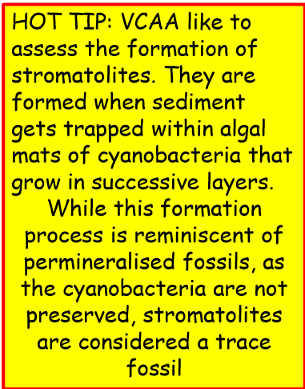

---
---
### Indirect

Mould and cast fossils
- body decomposed or removed; **no organic material preserved**
- cast - mould filled with other materials then covered by sedimentary layers

Trace
- preserved evidence of animal's **activity or behaviour**
- eg mineralised faeces, footprints, burrows, nests

note the old bacteria isn't there anymore sand got trapped and replaced them

### Direct
parts of the structures of an organism, such as bones leaves or teeth

Mineralised
- aka petrified
- organic matter **gradually replaced by** hard **minerals**, leaving replica of original fossil
- assume no longer carbon based

Mummified
- trapped in conditions that **reduce decay** - organism not changed much (original organic matter preserved)