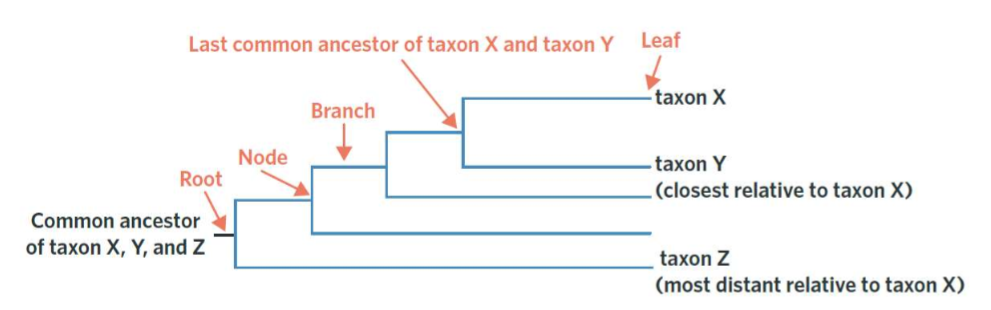
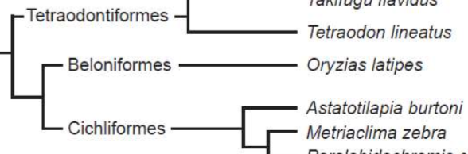
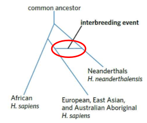
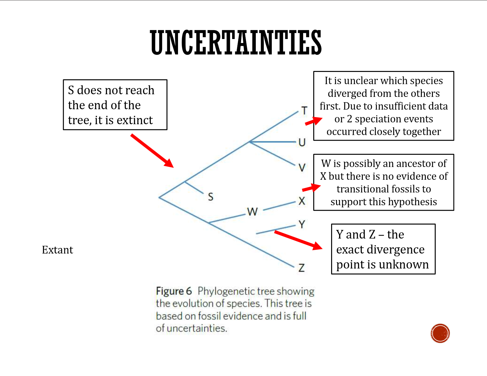

---
---

use the term "diverge". if tells you when say "point of divergence"
need to be able to circle the LCA

leaf is end of a branch
root represents earliest common ancestor

Interpret by reading backwards- see which are most closely related  
  
might be asked about are _ or _ closer related  
- just because they are drawn on the same x value doesn't mean they are the same closely related

trees might have a timeline

^^ o latipes is more closely related to M zebra than T lineatus (think, which would share more traits)

justification (3 marks)
- share a more recent common ancestor (say age if given)
- therefore less time to accumulate differences in DNA
- mention specific case in question, number of nucleotide differences if known

- the _ is the closest as it only has _ different, diverging most recently. The next closest is the _ which has _ different the _ diverged early on

**Fancy stuff**

interbreeding
genetic material passed between groups after divergence

