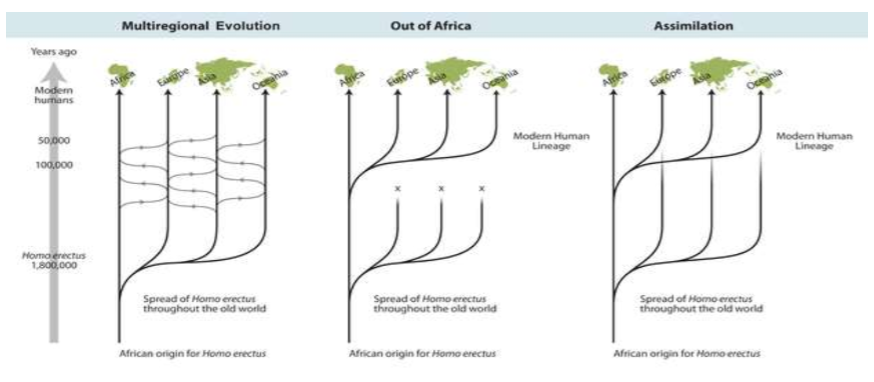

---
---
Varying fossil record interpretations
+human migration

haplogroup
- groups with similar dna (usually mitochondrial)

Models of human expansion
- Continuity model (Multiregional evolution)
	*Homo erectus* moved into all and they all evolved through interbreeding
- Replacement model (Out of africa)
	The initial move out all went extinct and homo sapiens took over (homo sapiens evolved in africa)
	(the dna doesn' seem to support the other two)
- Partial replacement model (Assimilation)
	The second move out interbreeded with the homo erectus

evidence for out of africa
- oldest homo sapien fossil found in africa
- mtDNA suggests this
- african group has most genetic diversity

Basically- "depending on the evidence presented we will need to adjust our understanding"

1st wave out of africa - ~160k-100k years ago
2nd wave - ~60k years ago

*source: https://www.nature.com/scitable/content/ne0000/ne0000/ne0000/ne0000/99195729/Bailey_fig1_v5LKrevised_1_2.jpg*