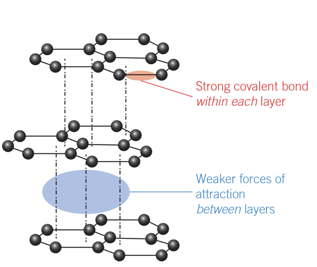

---
---
They are both pure carbon structures.
Carbon can form covalent bonds with other carbon atoms

Allotropes
- one of the different physical forms of a compound (of a single element) due to different structural arrangement of atoms
- due to different types of bonds between atoms. As they are arranged differently they exhibit different properties.

network
- a continuous arrangement of atoms, extending outwards.

lattice
- a regular 3D arrangement of atoms

**Diamond**
- 3D covalent network lattice
- rigid, tetrahedral.
- High melting points (due to strong covalent bonds)
- Hard (due to rigid lattice structure)
- Not conductive (no free electrons as each carbon has 4 covalent bonds, tetrahedral)
- Insoluble (due to covalent bonds) (see wb pg 254)
- Applications
	- jewelery
	- dental
	- eg cutting tools, abrasives
	- optical - diamond lasers (reflect light)

**Graphite**
- 2D carbon lattices (covalent layer lattice)
- Atoms are covalently bound together in a 2D arrangement to form layers held together by weak dispersion forces (between the layers)
- Each carbon is only bound to 3 other carbons - there are free electrons.
- The delocalised electron on each carbon atom moves freely within the whole sheet of carbon atoms in one layer.
- High melting point (covalent bonds)
- Soft slippery surface (due to layered structure)
- High thermal conductivity (delocalised electrons)
- Lower density than diamond (Because of the greater distance between the layers of graphite. The layers are held there by dispersion forces which are far weaker than the covalent bonds in the diamond lattice.)
- Layers can slide making it a good lubricant.
- Insoluble (due to covalent bonds not being overcome by intermolecular bonds of a solvent)
- uses
	- Battery anode in lithium-ion batteries
	- solid lubricant material (layers of graphite can slide over each other reducing friction)