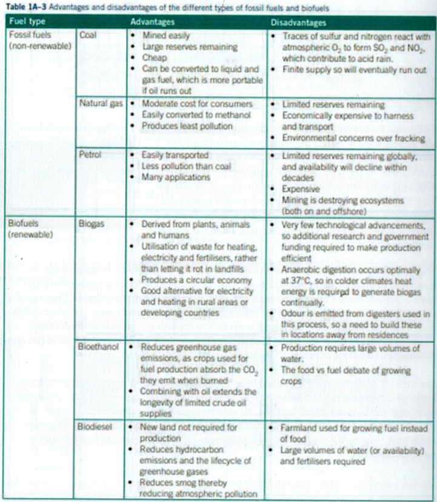

---
---
**Non renewable**
- made from decaying organic matter
- millions of years to form
- cannot be replenished in a short time frame
- used at a faster rate than they are being produced

**Renewable**
- source (state it) can be replenished within a short time frame
- therefore can be produced as required

| fuel                   | source                                                               | renewable         |                                                                                                      |
| ---------------------- | -------------------------------------------------------------------- | ----------------- | ---------------------------------------------------------------------------------------------------- |
| Coal🪨                 | decaying organic matter (carbon)                                     | no fossil fuel | $C + O_2 \rightarrow CO_2$                                                                           |
| Crude Oil (petroleum)⛽ | mixture of hydrocarbons (C + H) LPG - mixture of propane + butane | no fossil fuel | made via fractional distillation- separation via BP                                                  |
| Petrodiesel            | crude oil 75% alkanes 25% aromatic hydrocarbons                | no fossil fuel | most common form of diesel fuel                                                                      |
| Natural gas🐄          | methane                                                              | no fossil fuel |                                                                                                      |
| Biogas                 | organic matter (we are burning methane) methane + co2          | yes biofuel    | made via anaerobic resp                                                                              |
| Bioethanol🎋           | sugarcane                                                            | yes biofuel    | anaerobic cellresp. Then ethanol distilled so it can be combusted (in fermentation ethanol is aq) |
| Biodiesel 🚛        | mixture of esters (question will say) canola plants               | yes Biofuel    |                                                                                                      |

**Complete vs incomplete combustion**
Complete: fuel is combusted in a plentiful supply of O2(g). Products: CO2(g) and H2O.
Incomplete: insufficient supply of O2(g). Products: CO(g) and H2O

**Discuss the renewability of CH4 as a fuel**

| Biogas                                                                                                                                                    | Natural gas                                                                                                                                       |
| --------------------------------------------------------------------------------------------------------------------------------------------------------- | ------------------------------------------------------------------------------------------------------------------------------------------------- |
| - Sourced from decaying plant/organic matter - plants can be replenished as required - Therefore biogas can be produced as required - **renewable** | - sourced from decaying organic matter - Takes millions of years to form - Used at a faster rate than it is produced - **non renewable** |

**Discuss the carbon neutrality of coal as a fuel compared to bioethanol** (2 marks)

| Bioethanol                                                                                                                                                    | Coal                                                                                                                                                               |
| ------------------------------------------------------------------------------------------------------------------------------------------------------------- | ------------------------------------------------------------------------------------------------------------------------------------------------------------------ |
| - Sourced from plants (sugar cane) which absorb CO2 via photosynthesis - Releases CO2 upon combustion - no net emission of CO2, **more** carbon neutral | - sourced from plants/organic matter which absorbed CO2 millions of years ago. - Releases CO2 upon combustion - therefore net release of Co2, less C neutral |

